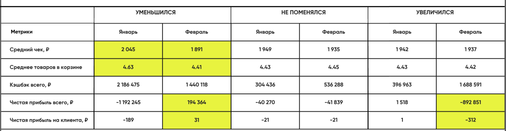
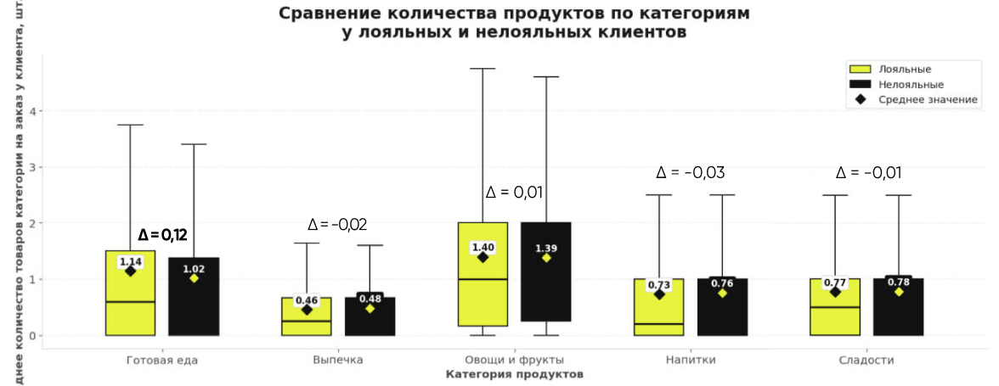
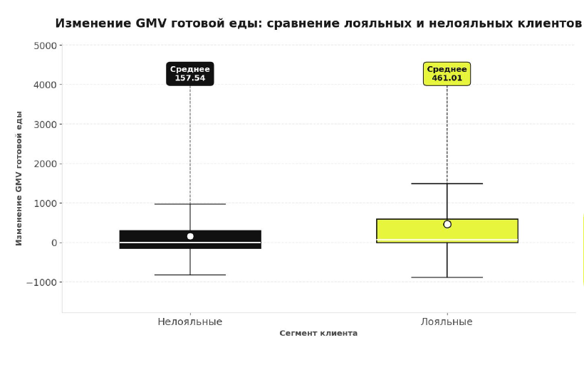

# Dano-ITMO-2026
Хакатон ДАНО в университете ИТМО

# Продуктовая баталия 

---
####  Легенда
**Т-Банк** - онлайн-банк, пятый в рейтинге банков России по активам.

**Город** — это раздел в приложении Т-Банка, где собраны сервисы для жизни.

---

### Информация о датасете
*Информация о клиентских транзакциях в сервисе «Супермаркеты в Городе»*

- 102 351 записи от 50 366 клиентов
- Транзакционный вид данных
- 1 строка = 1 транзакция клиента
- Данные за 2 недели (28 января - 11 февраля 2026 года) + агрегированные исторические показатели
- в среднем 2 заказа на клиента

## Преданализ

###  1. Очистка данных
102351 записи -> 

удаляем 0,23% данных (найдено 9 полных дублей + 114 заказов с конфликтующим процентом кэшбэка (конфликтующий заказ — это ситуация, когда один и тот же id_заказа встречается несколько раз, но в строках указан разный процент_кэшбэка)) -> 

102228 уникальных данных

### 2. Агрегация данных 
Исходные данные представлены на уровне заказов, поэтому для сегментации клиентов мы сначала агрегируем данные до уровня (для каждого клиента отдельно считаем показатели за январь и отдельно за февраль):

##### клиент × месяц

##### Для каждого клиента и месяца:

- Кол-во заказов = число уникальных id_заказа
- GMV = сумма GMV с наценкой
- Выручка = сумма выручки по заказам
- Кэшбэк в рублях = сумма кэшбэка по заказам
- Средний кэшбэк, % = средний процент кэшбэка по заказам клиента
- Средний чек = GMV / Кол-во заказов
- Частота заказов в неделю = Кол-во заказов / Кол-во дней в месяце × 7
- Средняя корзина = среднее количество товаров в заказе
- Чистая прибыль = Выручка − Кэшбэк в рублях

### 3. Оставляем клиентов, которые есть и в январе, и в феврале
Это важно, потому что мы сравниваем не разные группы клиентов, а изменение поведения одних и тех же пользователей.

*11 098 записей*

### 4. Смотрим изменение кэшбэка
Для каждого клиента считаем изменение среднего процента кэшбэка

**Изменение кэшбэка**, п.п. = Средний кэшбэк в феврале − Средний кэшбэк в январе

---

### Ввод переменной (неактуально)
Нужно посчитать **реальную наценку** на корзину, так как часть товаров не облагается наценкой, но в данных это не указано. Введём новую переменную:

**Реальная наценка** = ((GMV с наценкой - GMV без наценки) / GMV без наценки) * 100%

Пример аномальных данных:

|order_id|наценка|GMV с наценкой| GMV без наценки |
|-----|-----|-----|-----------------|
|10|9|554| 554             |
|64|5|871,3| 871,3           |

--- 
## Сегментация 
Мы сегментируем клиентов не просто по уровню кэшбэка, а по **реакции на снижение кэшбэка**. Основная идея: посмотреть, как изменение условий кэшбэка связано с изменением поведения клиента — среднего чека, частоты заказов, корзины и финансовых метрик.

### Сравниваем метрики относительно изменения кэшбэка
Кэшбэк в рублях = GMV с наценкой × Процент кэшбэка / 100 

Выручка = GMV с наценкой − GMV без наценки


Чистая прибыль = Выручка − Кэшбэк в рублях

Чистая прибыль показывает, сколько компания фактически зарабатывает с заказа после учёта наценки и выплаты кэшбэка клиенту.

=>

- У пользователей **с понижением кэшбэка наблюдается снижение среднего чека и корзины**. При этом в остальных группах эти метрики меняются слабее.
- У пользователей **с понижением кэшбэка чистая прибыль становится положительной**
- У пользователей **с повышением кэшбэка банк может уходить в минус** из-за роста выплат
- 
### Считаем изменение среднего чека

- **Средний чек февраля** = GMV февраля / Количество заказов февраля
- **Средний чек января** = GMV января / Количество заказов января
- **Изменение среднего чека** = (Средний чек февраля - Средний чек января) / Средний чек января * 100%

### Сегментируем клиентов
Для сегментации берём только клиентов, у которых кэшбэк снизился.

 
Средний кэшбэк февраля < Средний кэшбэк января

 
Далее смотрим, как изменился их средний чек.

**Лояльный клиент** - клиент, у которого после ухудшения условий кэшбека не произошло существенного падения среднего чека (55,42%)

**Нелояльный клиент** - клиент, который чувствительно отреагировал на снижение кэшбека и стал тратить заметно меньше (44,58%)

Правило сегментации:


Если изменение среднего чека <= -10%, то клиент нелояльный.
 
Если изменение среднего чека > -10%, то клиент лояльный.

### Распределение категорий

Разница в готовой еде *максимальна*, поэтому мы смотрим по ней

---
## Исследовательский вопрос 

Как снижение кэшбека связано с изменением покупательского поведения клиентов?

Отличаются ли лояльные и нелояльные клиенты по чистой прибыли и спроса на готовую еду?

## Гипотеза 

У лояльных клиентов не изменяется выручка, чистая прибыль и спрос на категорию готовых продуктов, по сравнению с нелояльными.

---

## Механизм 
У лояльных клиентов сформирована привычка покупать готовую еду. Поэтому уменьшение кэшбека/появление наценки не приводит к падению среднего чека. Таким образом, выручка стабильна, и чистая прибыль сохраняется.

## Мат модель

Итоговый размер выборки: 6294
Уровень стат значимости: 0,05
Для Т-критерия тестом Левене: p-value < 0,05

   

Критерий Левене p-value < 0,0001
Т-критерий с p-value < 0,0001

Cohen`s d: 303,47

Вывод: Различие статистически значимо на уровне 5%. Лояльные клиенты имеют большее изменение, чем нелояльные.

## Альтернативный механизм
Чем больше доход у клиента, тем он более лоялен (не смотрит на цены), а следовательно, тем выше его средний чек на готовую еду

### 

---

## Подвал
пиздец пиздец

С ростом наценки на готовую еду клиенты увеличивают её долю в корзине, сокращая другие категории. Готовая еда остаётся приоритетной даже при ухудшении условий.

